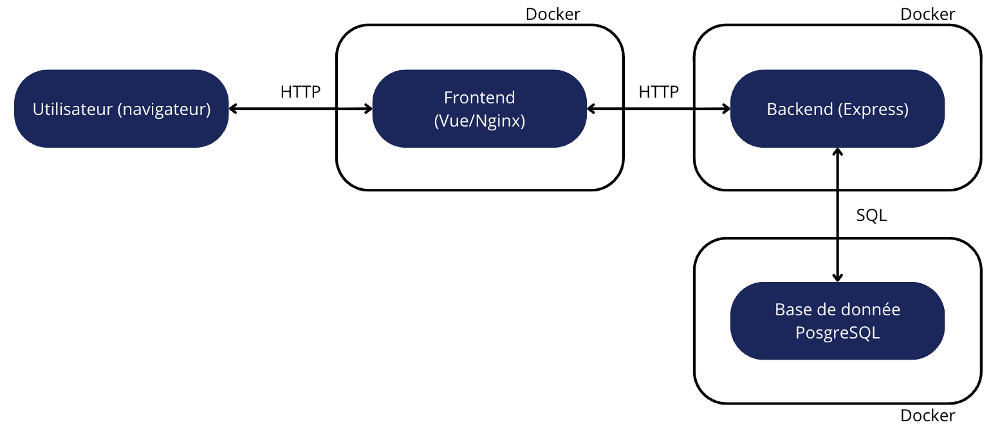
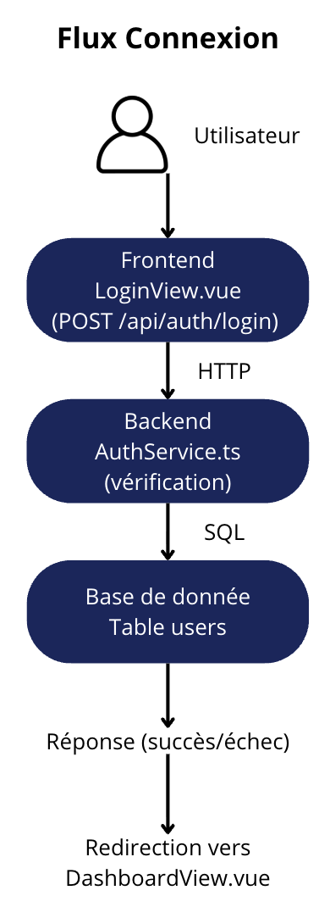
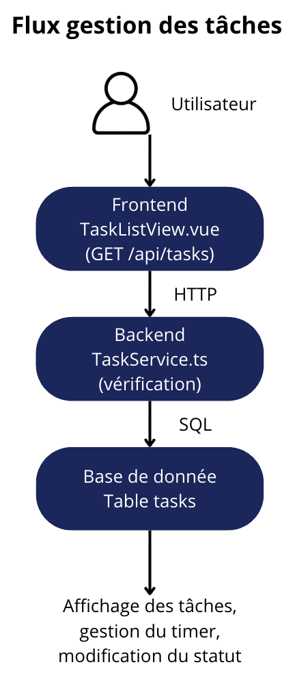
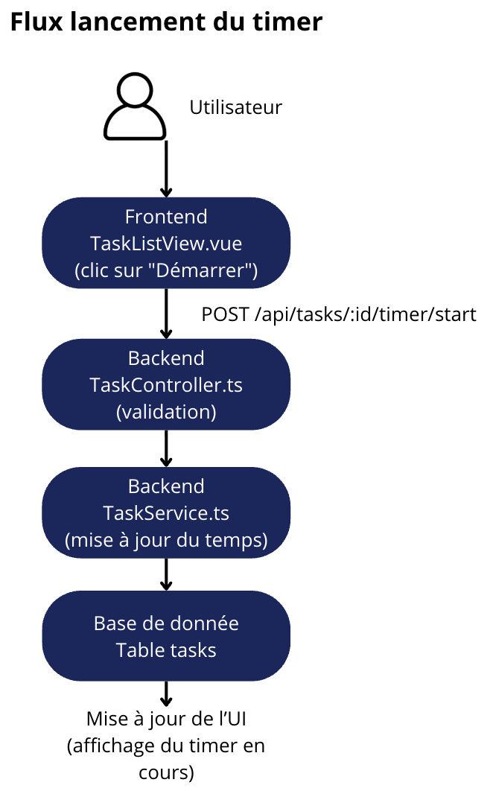
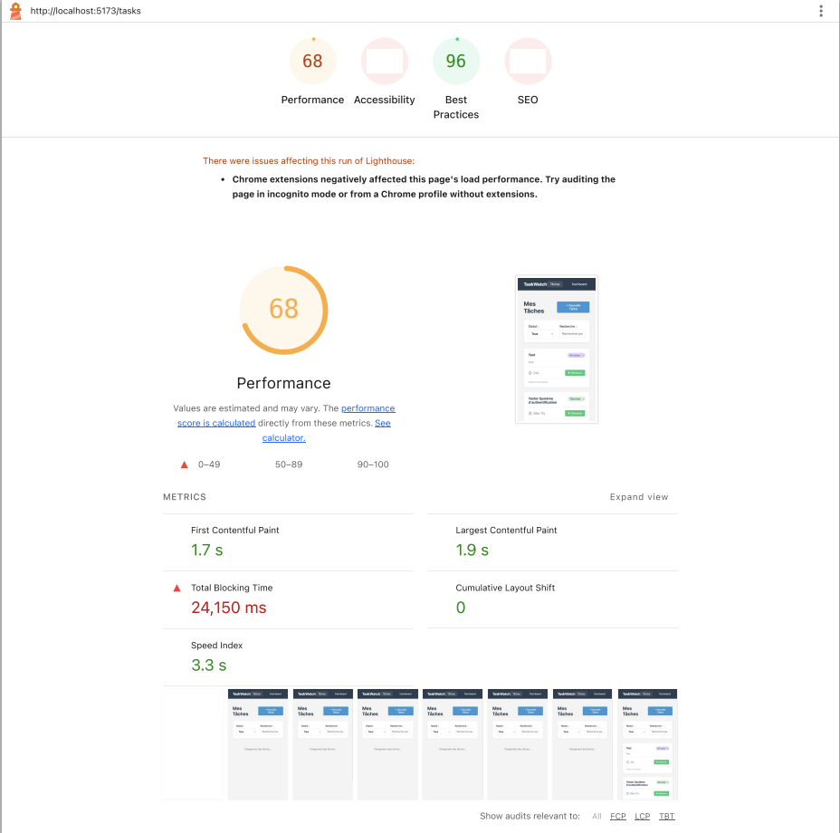
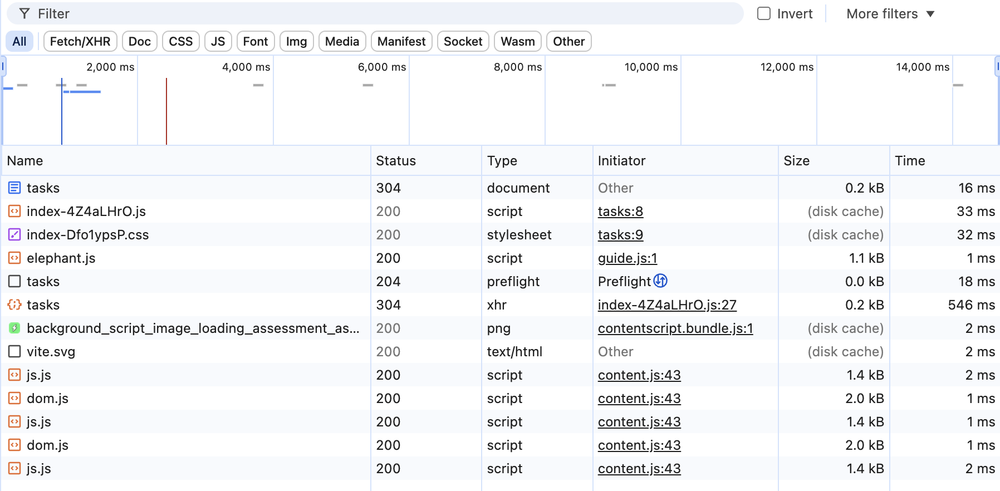
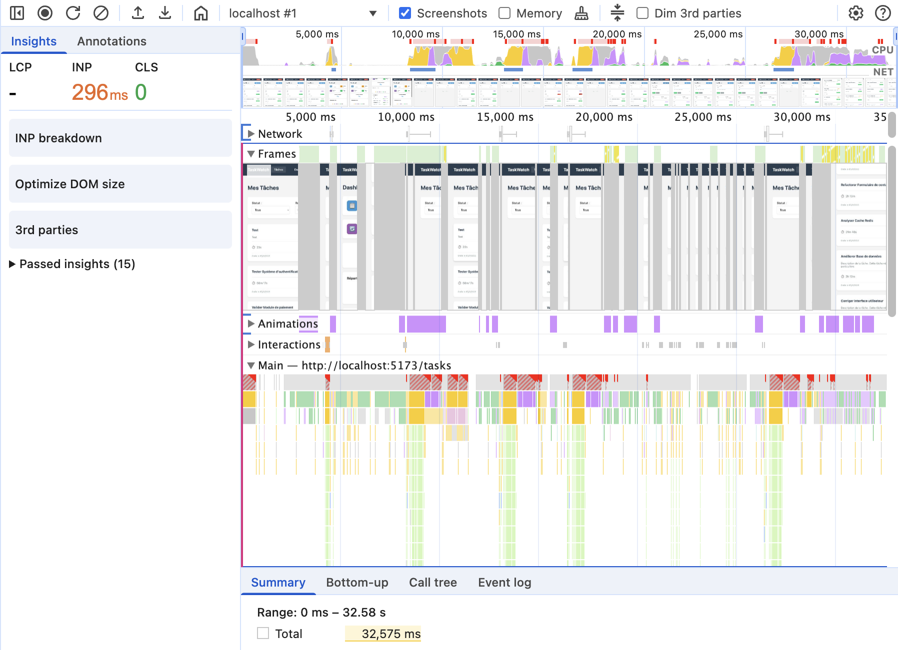
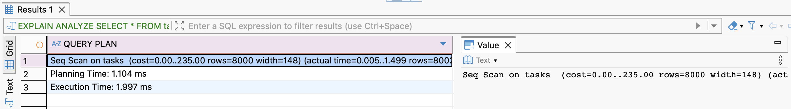
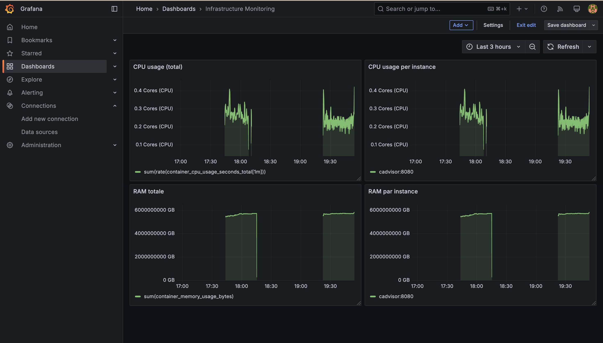

# Rapport d’Audit - TaskWatch

## Table des matières

1. Analyse de l'architecture
2. Instrumentation et collecte de métriques
3. Description des optimisations implémentées
4. Résultats avant/après
5. Recommandations

## 1. Analyse de l'architecture

L’application TaskWatch est composée d’un frontend Vue 3 (Vite) qui communique via HTTP (Axios) avec une API backend Node.js Express. Le backend accède aux données via PostgreSQL. L’ensemble est orchestré via Docker Compose (et Nginx est utilisé pour servir le frontend en production).

1. **Schéma d’architecture**

   

2. **Flux utilisateurs**

   

   

   

3. **Documentation des points d’entrée et de sortie**

   - Endpoints API principaux :
     - /api/auth (login, register)
     - /api/tasks (CRUD, timer)
     - /api/dashboard (statistiques)
   - Points d’entrée frontend :
     - /login (LoginView)
     - /dashboard (DashboardView)
     - /tasks (TaskListView)

## 2. Diagnostic technique avec métriques

1. **Analyse**

**Rapport Lighthouse (frontend)**

**Ce qui ne va pas**

- Score Performance moyen (68).
- Total Blocking Time extrêmement élevé (~24 s).
- Indique un thread principal bloqué trop longtemps (JS lourd / trop de re-renders).

**Causes racines :**

- Fonction inutilement lourde (`heavyComputation`) exécutée au chargement de la page `/tasks`.
- Trop de traitements sur la liste des tâches côté frontend (clonage, tris, re-renders).

**Captures DevTools (réseau, performance)**

**Ce qui ne va pas**

- Requête GET /tasks relativement lente (~500 ms).
- Requête appelée fréquemment.
- Présence d’un preflight CORS (requête supplémentaire inutile dans certains cas).
- Volume réseau non maîtrisé (probable absence de pagination).

**Causes racines :**

- Pas de pagination côté backend ni frontend : toutes les tâches sont chargées à chaque fois.
- API retourne toutes les colonnes, même inutiles.
- Préflight CORS dû à la configuration des headers.

**Ce qui ne va pas**

- Beaucoup de “long tasks” (zones rouges).
- Re-renders fréquents sur la page /tasks.
- Le front consomme du CPU pour des traitements répétitifs.

**Causes racines :**

- Changements d'état non optimisés et traitements répétitifs dans le code Vue.

**Résultats EXPLAIN ANALYZE (requêtes SQL)**

**Ce qui ne va pas**

- Seq Scan sur la table tasks.
- Requête récupérant toutes les lignes (~8000).
- Pas de pagination / pas de sélection fine des colonne

**Causes racines :**

- Requêtes SQL sans `LIMIT`/`OFFSET` ni sélection de colonnes.
- Pas d'index sur les colonnes filtrées (`status`, `name`).

**Dashboards Grafana**

2. **Diagnostic**

Voici les principaux problèmes identifiés :

- **Côté frontend** :

  - Le site est lent car il fait des calculs inutiles et charge trop de tâches d’un coup.

- **Côté backend** :

  - L’API renvoie toutes les tâches d’un coup, ce qui ralentit la base de données et le réseau.
  - Les recherches sont lentes car il manque des index et on ne sélectionne pas que les colonnes utiles.

- **Sécurité** :

  - Le système d’authentification n’est pas sécurisé (le token est juste un ID).

- **Infrastructure** :
  - Il y a des requêtes réseau inutiles à cause de la configuration CORS.

**Conséquences :**

Tout cela rend l’application lente, difficile à utiliser et moins sûre. Il faut donc corriger en priorité l’API (pagination, index), alléger le frontend et sécuriser l’authentification.

## 3. Description des optimisations implémentées

## 4. Résultats avant/après

## 5. Recommandations

### Conseils pour la maintenance et l’amélioration continue

- Garder le code simple et bien commenté pour faciliter les évolutions.
- Mettre en place des tests automatisés (même simples) pour éviter les régressions.
- Surveiller régulièrement les performances (Lighthouse, DevTools, EXPLAIN) et corriger dès qu’un ralentissement apparaît.
- Documenter les choix techniques et les endpoints API pour faciliter la prise en main par d’autres développeurs.

### Pistes d’optimisation futures

- Ajouter la pagination côté backend et frontend pour limiter la quantité de données chargées.
- Optimiser les requêtes SQL (sélectionner uniquement les colonnes nécessaires, ajouter des index sur les colonnes filtrées).
- Sécuriser l’authentification avec de vrais tokens JWT.
- Améliorer la gestion des erreurs et des messages utilisateur.
- Mettre en place un monitoring plus poussé (Prometheus, Grafana).

---

Remarque : Les parties 3 (optimisations implémentées) et 4 (résultats avant/après) n’ont pas été réalisées faute de temps.
